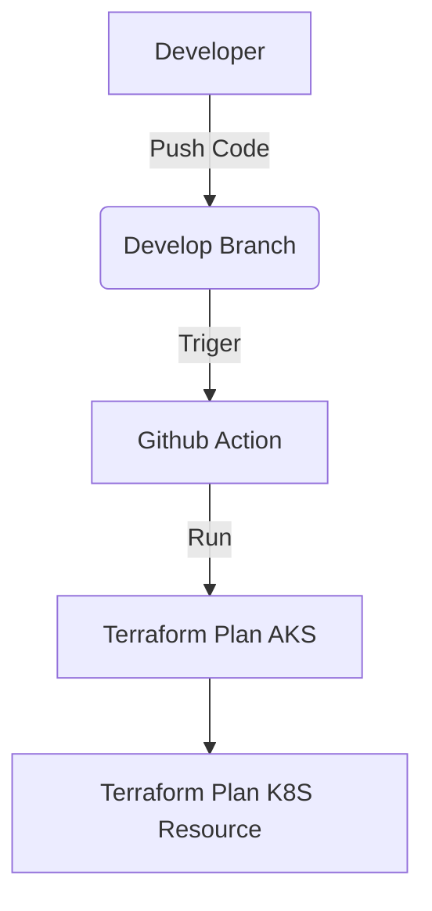
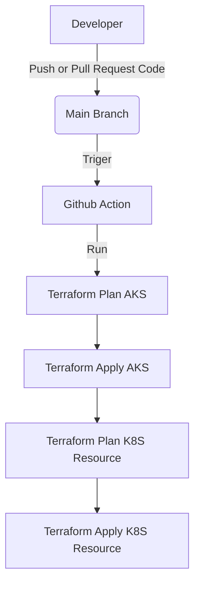
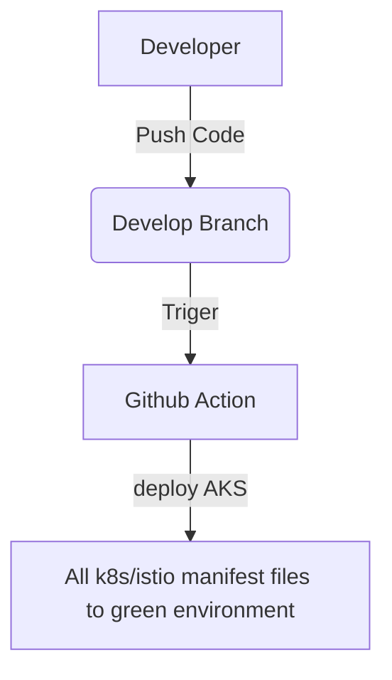
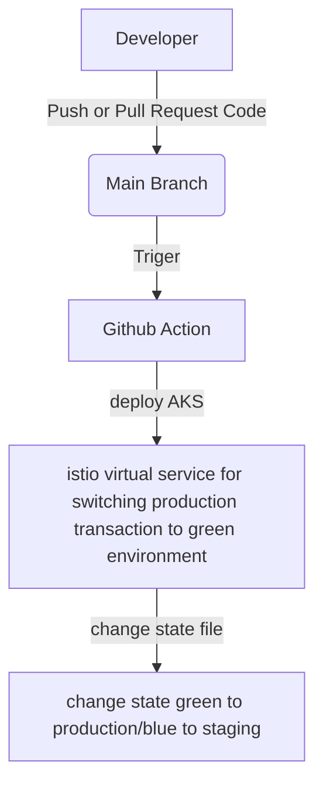

# question no 5.
## challenging
- unfamiliar with tools (github action, istio)

## All Tools List
- Terraform (with azurerm, helm, kubernetes provider)
- GitHub
- GitHub Action
- Azure Kubernetes Service (AKS)
- Azure Storage Account

## question no 1,2
Link: https://github.com/test0012347194/1_2_Terraform_AKS_Istio

### description
To automatically run terraform code to provision AKS and install istio then store terraform state file in Azure Storage Account by github action. There are 2 branches in this repository please see description on below diagram





## question no 3
Link: https://github.com/test0012347194/3_Blue_Green_Istio

### description
To automatically deploy pod in AKS Cluster and Istio service mesh with blue-green deployment strategy. 
by using file in branch name state to keep information about which blue and which green
There are 2 branches in this repository to run github action please see description on below diagram (assume that blue is production environment and green is staging environment)





# question no 6.
## 6.1. This deployment is currently not working properly, can you figure out why.
6.1.1 
1. wrong port in service. port shoud be 80, targetPort shoud be 8000
```yaml
service
  ports:
  - port: 8000
    targetPort: 80
```
2. wrong port in deployment. port shoud be 8000
```yaml
    ports:
        - containerPort: 80
```
3. wrong selector in service. .Values.deployment.default shoud be .Values.deployment.depRegion
```yaml
  selector:
    svc-name: {{ .Values.image.name }}-{{.Values.deployment.default}}
```

## 6.2. When querying different endpoints it should show each of the different services you created on the previous step:
> can not querying different endpoints according to question. because of node js code is not design to that way

## 6.3.1 Expose this service to outside of the cluster by istio gateway ingress controller.
> run command kubectl label namespace interview istio-injection=enabled and then apply istio manifest name 6.3.1 istioconfig in this repository

## 6.3.1 When query http://<address>/eu should load balancing round robind shows belows output
> can not do because of answer in 6.2.

# question no 7.
> please see file 7.python_assignment.py. it will write log (please see example in file 7.python_assignment_output_example.log). The log collector tools (e.g, filebeat, fluentbit) can get log from file and monotoring cluster